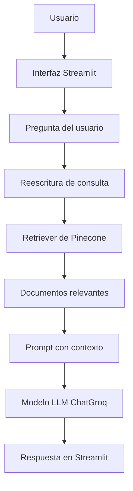

# Labor Insights Agent

Labor Insights Agent es un proyecto orientado a la consulta y análisis de información laboral peruana. Su propósito actual es proporcionar una interfaz web mínima para consultar documentos y generar respuestas mediante un flujo RAG (Retrieval-Augmented Generation) con Pinecone como base vectorial.

Este agente NO es un chatbot genérico. Es una herramienta de exploración de información basada en la recuperación semántica de documentos y en la generación de respuestas a partir del contexto recuperado.

## 1. Descripción general

Labor Insights Agent está diseñado para investigadores y analistas que desean consultar información sobre el mercado laboral peruano a partir de documentos indexados en Pinecone. El código actual ofrece una aplicación web construida con Streamlit que recibe preguntas del usuario, las procesa mediante un flujo RAG y devuelve respuestas basadas en el conocimiento almacenado.

### Alcance actual

- Interfaz web con Streamlit.
- Recuperación semántica en Pinecone.
- Uso de un modelo LLM `ChatGroq` para generar respuestas.
- Reescritura/optimización de consultas antes de la búsqueda semántica.
- Respuestas basadas en documentos indexados.

### Capacidades en desarrollo / futuras mejoras

- El proyecto muestra una referencia a `Datos CSV (Próximamente)` en la interfaz, pero la versión actual no integra procesamiento activo de CSV en el flujo de consulta.

## 2. Características principales

- Consulta de documentos mediante RAG.
- Recuperación semántica de información con Pinecone.
- Uso de `ChatGroq` como modelo LLM para generar respuestas.
- Uso de `HuggingFaceEmbeddings` con el modelo `intfloat/multilingual-e5-small`.
- Reescritura de consultas para mejorar la búsqueda semántica.
- Interacción mediante una interfaz web con Streamlit.
- Carga de variables de entorno con `python-dotenv`.

## 3. Fuentes de conocimiento

El proyecto utiliza como fuente principal documentos indexados en Pinecone relacionados con la Encuesta Permanente de Empleo Nacional (EPEN).

### Fuentes utilizadas actualmente

- Documentos indexados en Pinecone vinculados a EPEN.
- Base de conocimiento RAG almacenada en el índice vectorial de Pinecone.

### Fuentes no conectadas actualmente

- Aunque la interfaz sugiere `Datos CSV (Próximamente)`, en la versión actual no hay integración funcional con archivos CSV en el flujo de consulta.

## 4. Arquitectura de la solución



### Componentes

- **Usuario**: ingresa preguntas sobre empleo, desempleo, ingresos o ciudades.
- **Interfaz Streamlit (`app.py`)**: muestra la UI y captura la pregunta del usuario.
- **Reescritura de consulta**: el prompt interno refina la pregunta antes de buscar en Pinecone.
- **Retriever de Pinecone**: realiza la búsqueda semántica en el índice vectorial.
- **Documentos relevantes**: se extrae el contenido contextual de los resultados de búsqueda.
- **Prompt con contexto**: se construye el prompt que se envía al modelo.
- **Modelo LLM (`ChatGroq`)**: genera la respuesta final.
- **Respuesta**: se muestra en la aplicación Streamlit.

### Flujo RAG real

1. El usuario escribe una pregunta en la interfaz.
2. La pregunta se envía al `rag_chain`.
3. El sistema reformula la consulta para mejorar la búsqueda semántica.
4. El retriever busca en Pinecone.
5. Se recuperan los documentos más relevantes.
6. El contexto recuperado se incorpora al prompt del modelo.
7. `ChatGroq` genera la respuesta.
8. La respuesta se presenta en Streamlit.

## 5. Tecnologías y herramientas utilizadas

| Tecnología | Uso en el proyecto |
|---|---|
| Python | Lenguaje principal del proyecto |
| Streamlit | Interfaz web |
| LangChain | Construcción de cadenas de LLM y prompts |
| LangChain Hugging Face | Embeddings con Hugging Face |
| HuggingFaceEmbeddings | Generación de vectores semánticos |
| `intfloat/multilingual-e5-small` | Modelo de embeddings usado |
| LangChain Pinecone | Conexión a Pinecone |
| Pinecone | Base de datos vectorial |
| Groq | Modelo de inferencia para el LLM |
| ChatGroq | Cliente LLM usado en el proyecto |
| python-dotenv | Carga de variables de entorno |

## 6. Estructura del proyecto

```text
labor-insights-agent/
│
├── app.py
├── herramientas.py
├── requirements.txt
├── .env
├── documents/
│   └── ...
└── README.md
```

### Archivos clave

- `app.py`: aplicación Streamlit principal.
- `herramientas.py`: define el retriever, el modelo, el RAG chain y la consulta de respuesta.
- `requirements.txt`: dependencias del proyecto.
- `.env`: variables de entorno necesarias para Groq y Pinecone.
- `documents/`: carpeta que contiene los archivos de documentos relacionados.

### Notas adicionales

- No se encontró un archivo `.env.example` en el repositorio actual.
- El flujo de consulta RAG está implementado en `herramientas.py` y consumido desde `app.py`.

## 7. Variables de entorno requeridas

El proyecto usa las siguientes variables de entorno:

- `API_KEY_GROQ`
- `MODEL_NAME_GROQ`
- `API_KEY_PINECONE`

## 8. Uso básico

1. Instala dependencias:
   ```bash
   pip install -r requirements.txt
   ```

2. Crea un archivo `.env` con las claves necesarias.

3. Ejecuta la app:
   ```bash
   streamlit run app.py
   ```

## 9. Estado actual del proyecto

- La versión actual es una interfaz RAG funcional para consultas sobre documentos indexados en Pinecone.
- El soporte CSV se muestra como planificado en la UI, pero no está integrado en el flujo de consulta actual.
- No hay archivo `.env.example` en el repositorio actual.