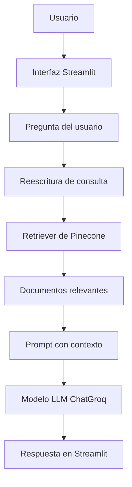

# Labor Insights Agent

Labor Insights Agent es un proyecto orientado a la consulta y análisis de información laboral peruana. Su propósito actual es proporcionar una interfaz web mínima para consultar documentos y generar respuestas mediante un flujo RAG (Retrieval-Augmented Generation) con Pinecone como base vectorial.

Este agente NO es un chatbot genérico. Es una herramienta de exploración de información basada en la recuperación semántica de documentos y en la generación de respuestas a partir del contexto recuperado.

## 1. Descripción general

Labor Insights Agent está diseñado para investigadores y analistas que desean consultar información sobre el mercado laboral peruano a partir de documentos indexados en Pinecone. El código actual ofrece una aplicación web construida con Streamlit que recibe preguntas del usuario, las procesa mediante un flujo RAG y devuelve respuestas basadas en el conocimiento almacenado.

### Alcance actual

- Interfaz web con Streamlit.
- Recuperación semántica en Pinecone.
- Uso de un modelo LLM `ChatGroq` para generar respuestas.
- Reescritura/optimización de consultas antes de la búsqueda semántica.
- Respuestas basadas en documentos indexados.

### Capacidades en desarrollo / futuras mejoras

- El proyecto muestra una referencia a `Datos CSV (Próximamente)` en la interfaz, pero la versión actual no integra procesamiento activo de CSV en el flujo de consulta.

## 2. Características principales

- Consulta de documentos mediante RAG.
- Recuperación semántica de información con Pinecone.
- Uso de `ChatGroq` como modelo LLM para generar respuestas.
- Uso de `HuggingFaceEmbeddings` con el modelo `intfloat/multilingual-e5-small`.
- Reescritura de consultas para mejorar la búsqueda semántica.
- Interacción mediante una interfaz web con Streamlit.
- Carga de variables de entorno con `python-dotenv`.

## 3. Ejemplos de preguntas y respuestas

### Pregunta 1
**¿Cuál es el objetivo de la EPEN y qué información busca recopilar?**

**Respuesta:**
El objetivo de la Encuesta Permanente de Empleo Nacional (EPEN) es producir y difundir estadísticas oficiales del mercado laboral a nivel nacional y en 27 ciudades del Perú. La EPEN busca recopilar información sobre el comportamiento de los indicadores del mercado laboral, incluyendo variables como:

- Características de los miembros del hogar
- Empleo
- Ingreso del trabajador independiente y productor agropecuario
- Condición de actividad
- Ingreso por trabajo de la ocupación principal
- Pago en especie
- Desocupados
- Aseguramiento en salud
- Educación
- Migración
- Discapacidad
- Etnicidad

La EPEN se ejecuta en el ámbito nacional en los 24 departamentos del país y la Provincia Constitucional del Callao, y se realiza en el periodo comprendido de enero a diciembre del 2026. La encuesta tiene un total de 152 preguntas, distribuidas en diferentes capítulos, y busca proporcionar información valiosa para entender el comportamiento del mercado laboral en el Perú.

### Pregunta 2
**¿Qué variables necesito para analizar el empleo según ciudad, sexo y edad?**

**Respuesta:**
Para analizar el empleo según ciudad, sexo y edad, necesitarías las siguientes variables:

1. **Ciudad**: La variable que indique la ciudad de residencia de la persona. En el texto disponible no se menciona explícitamente una variable para la ciudad; es posible que esta información se encuentre en algún metadato o en documentos relacionados a ciudades.
2. **Sexo**: La variable `207. Sexo` con código 1 para Hombre y 2 para Mujer.
3. **Edad**: La variable `208. Qué edad tiene en años cumplidos años` con un rango de 1 a 115 años.
4. **Condición de actividad**: La variable `303. La semana pasada, tuvo Ud. Algún trabajo (sin contar los quehaceres del hogar)` con código 1 para Sí y 2 para No, para determinar si la persona está empleada.
5. **Ocupación principal**: Las variables `308. Cuál es la ocupación principal que desempeñó - Código` y `309. A qué se dedica el negocio, organismo o empresa en la que trabajó en su ocupación principal. Código` para detalles sobre el tipo de empleo.
6. **Tamaño de la empresa**: La variable `317. En su trabajo, negocio o empresa, incluyéndose Ud., laboraron` para conocer el tamaño de la empresa donde trabaja.

Con estas variables, se puede analizar el empleo según ciudad (si esa información está disponible), sexo y edad, considerando la condición de actividad, el tipo de ocupación y el tamaño de la empresa.

### Pregunta 3
**¿Cómo se define y registra la situación laboral de una persona según las variables disponibles?**

**Respuesta:**
La situación laboral se define y registra mediante varias dimensiones:

1. **Ocupación principal**: Se registra con variables como:
   - `C308_COD`: Código de la ocupación principal.
   - `C309_COD`: Código de la actividad económica principal.
   - `C310`: Tipo de ocupación principal (empleador, trabajador independiente, empleado, etc.).
   - `C311`: Tipo de entidad donde trabaja (fuerzas armadas, administración pública, empresa privada, etc.).
2. **Horas trabajadas**: Se registra mediante:
   - `C318_1` a `C318_7`: Horas trabajadas en cada día de la semana.
   - `C318_T`: Total de horas trabajadas en la semana.
3. **Ingreso**: Se registra mediante:
   - `C339_1`: Ingreso total en la ocupación principal.
   - `C342`: Ganancia neta en la ocupación principal.
4. **Ocupación secundaria**: Se registra mediante:
   - `C330`: Normalmente trabaja en la ocupación secundaria.
   - `C331`: Número de horas trabajadas en la ocupación secundaria.
   - `C333`: Ingreso total en la ocupación secundaria.
5. **Búsqueda de empleo**: Se registra mediante:
   - `C335`: Buscó empleo en la semana pasada.
   - `C352`: Hizo algo para conseguir trabajo en la semana pasada.
6. **Desocupación**: Se registra mediante:
   - `C352`: Hizo algo para conseguir trabajo en la semana pasada.
   - `C353`: Qué estuvo haciendo la semana pasada.
   - `C354`: Quería trabajar en la semana pasada.
   - `C355`: Estuvo disponible para trabajar en la semana pasada.
7. **Inactividad**: Se registra mediante:
   - `C356`: Por qué no buscó trabajo en la semana pasada.

En resumen, la situación laboral se define a partir de variables que capturan la ocupación principal, las horas trabajadas, el ingreso, la ocupación secundaria, la búsqueda de empleo, la desocupación y la inactividad.

## 4. Fuentes de conocimiento

El proyecto utiliza como fuente principal documentos indexados en Pinecone relacionados con la Encuesta Permanente de Empleo Nacional (EPEN).

### Fuentes utilizadas actualmente

- Documentos indexados en Pinecone vinculados a EPEN.
- Base de conocimiento RAG almacenada en el índice vectorial de Pinecone.

### Fuentes no conectadas actualmente

- Aunque la interfaz sugiere `Datos CSV (Próximamente)`, en la versión actual no hay integración funcional con archivos CSV en el flujo de consulta.

## 5. Arquitectura de la solución



### Componentes

- **Usuario**: ingresa preguntas sobre empleo, desempleo, ingresos o ciudades.
- **Interfaz Streamlit (`app.py`)**: muestra la UI y captura la pregunta del usuario.
- **Reescritura de consulta**: el prompt interno refina la pregunta antes de buscar en Pinecone.
- **Retriever de Pinecone**: realiza la búsqueda semántica en el índice vectorial.
- **Documentos relevantes**: se extrae el contenido contextual de los resultados de búsqueda.
- **Prompt con contexto**: se construye el prompt que se envía al modelo.
- **Modelo LLM (`ChatGroq`)**: genera la respuesta final.
- **Respuesta**: se muestra en la aplicación Streamlit.

### Flujo RAG real

1. El usuario escribe una pregunta en la interfaz.
2. La pregunta se envía al `rag_chain`.
3. El sistema reformula la consulta para mejorar la búsqueda semántica.
4. El retriever busca en Pinecone.
5. Se recuperan los documentos más relevantes.
6. El contexto recuperado se incorpora al prompt del modelo.
7. `ChatGroq` genera la respuesta.
8. La respuesta se presenta en Streamlit.

## 6. Tecnologías y herramientas utilizadas

| Tecnología | Uso en el proyecto |
|---|---|
| Python | Lenguaje principal del proyecto |
| Streamlit | Interfaz web |
| LangChain | Construcción de cadenas de LLM y prompts |
| LangChain Hugging Face | Embeddings con Hugging Face |
| HuggingFaceEmbeddings | Generación de vectores semánticos |
| `intfloat/multilingual-e5-small` | Modelo de embeddings usado |
| LangChain Pinecone | Conexión a Pinecone |
| Pinecone | Base de datos vectorial |
| Groq | Modelo de inferencia para el LLM |
| ChatGroq | Cliente LLM usado en el proyecto |
| python-dotenv | Carga de variables de entorno |

## 7. Estructura del proyecto

```text
labor-insights-agent/
│
├── app.py
├── herramientas.py
├── requirements.txt
├── .env
├── documents/
│   └── ...
└── README.md
```

### Archivos clave

- `app.py`: aplicación Streamlit principal.
- `herramientas.py`: define el retriever, el modelo, el RAG chain y la consulta de respuesta.
- `requirements.txt`: dependencias del proyecto.
- `.env`: variables de entorno necesarias para Groq y Pinecone.
- `documents/`: carpeta que contiene los archivos de documentos relacionados.

### Notas adicionales

- No se encontró un archivo `.env.example` en el repositorio actual.
- El flujo de consulta RAG está implementado en `herramientas.py` y consumido desde `app.py`.

## 8. Variables de entorno requeridas

El proyecto usa las siguientes variables de entorno:

- `API_KEY_GROQ`
- `MODEL_NAME_GROQ`
- `API_KEY_PINECONE`

## 9. Uso básico

1. Instala dependencias:
   ```bash
   pip install -r requirements.txt
   ```

2. Crea un archivo `.env` con las claves necesarias.

3. Ejecuta la app:
   ```bash
   streamlit run app.py
   ```
